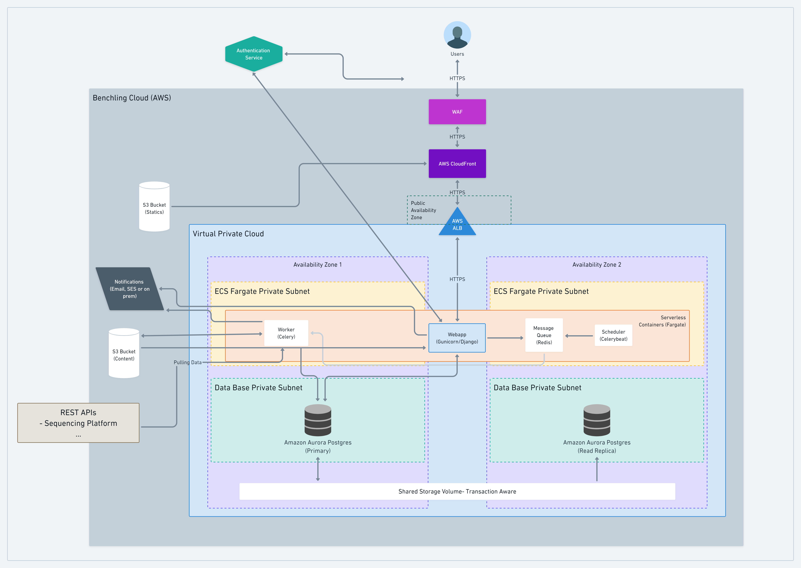

# Design Challenge - Benchling Notebook

Design Challenge: Designing the backend of [Benchling Notebook](https://www.benchling.com/notebook/).

- [Design Challenge - Benchling Notebook](#design-challenge---benchling-notebook)
  - [Aim](#aim)
  - [Challenge](#challenge)
  - [Backend Architecture Design](#backend-architecture-design)
  - [Database Schema](#database-schema)
  - [Acknowledgements](#acknowledgements)

## Aim

The aim of this project is to develop a potential backend design for [Benchling notebook](https://www.benchling.com/notebook/).

[Benchling Notebook](https://www.benchling.com/notebook/) is a cloud-based electronic notebook to manage and document experiments and projects. The notebook is very feature richt and even allows you to view and analyze plasmid maps inside the application, store information in table like structures or link projects.

## Challenge

The design of the application requires to be highly scalable and stable. Ideally the solution should be device independent, as scientists might work with various devices. The solution further requires some sort of audit trail and signing possibilities. The system must be able to handle large amounts of data as well as be able to search through it. The system must also allow to be able to provide viewers for specific file formats like plasmid maps, sequencing data etc.

## Backend Architecture Design

Considering that the application should be device independent a web application would be ideal. In order to improve stability and scalability it would be recommended to use containerization. A microservice like architecture pattern would improve flexibility on integrating new features like plasmid viewers, viewers for sequencing data,... . The database would primarily store only meta data, and the links to the content, which is stored in appropriate storing. This design would allow to optimize storage for each content type and implement and embed microservices in the application. As an example sequencing data. The sequencing data would be uploaded either by the user or through a worker/Rest API interaction. The content type would specify a rendering method which in turn could be an independent microservice. The sequence viewer/microservice would hence be embedded into the webpage. The advantage of this design is that new features / viewers can easily be added, exchanged, optimized, tested, scaled up/down or even removed depending on the need of the company/institute. The content type specific storing mechanism would further facilitate data type specific search methods and improve preprocessing/processing. As an example, one could create sequencing data specific search algorithms, which could be scheduled and cached.

_This figure was created with [Whimsical](https://whimsical.com/)_

## Database Schema

_This figure was created with [Whimsical](https://whimsical.com/)_

Leveraging the django ORM to create and manage the database. See [benchling_notebook](benchling_notebook/) folder for implementation examples.

## Acknowledgements

- [Benchling notebook](https://www.benchling.com/notebook/)
- [Whimsical](https://whimsical.com/) for quickly creating nice figures.
